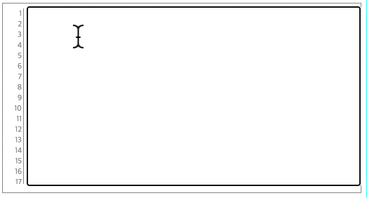
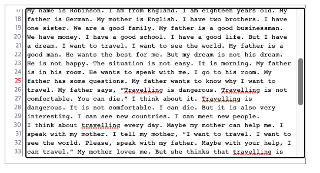

# Jquery-lined-textarea

[](https://www.w3schools.com/html/default.asp)
[](https://www.w3schools.com/css/default.asp)
[](https://jquery.com/)

## Synopsis

> Displays a line number to the left of the textarea.   
> you can easily use if jquery library is loaded.

## Manual
Just create textarea.
```html
<textarea id="article"></textarea>
```

Write code as below.
```javascript
 $("#article").linedtextarea({
   width:'100%', 
   height:"350px",
   selectedLine: 10,
 });
```

## options
TODO

## Screenshot


automatically `focus` line and apply `color` red.



